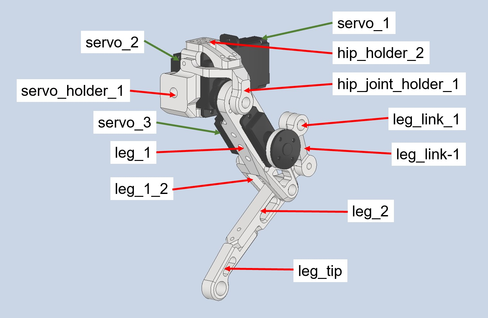
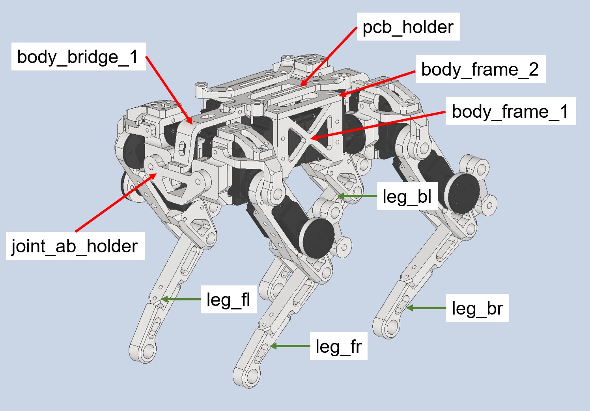
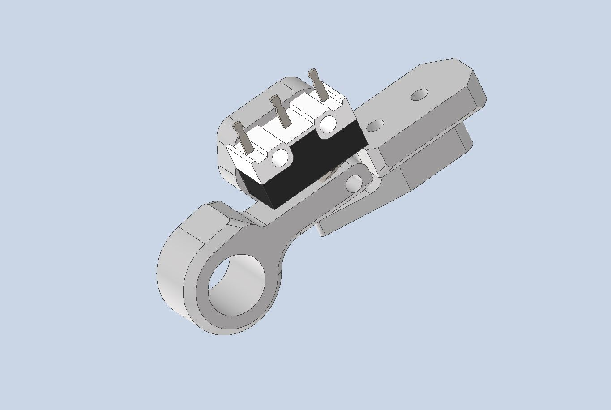
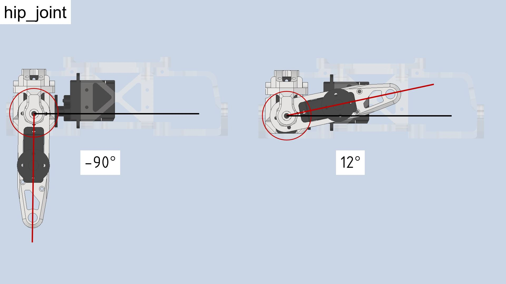
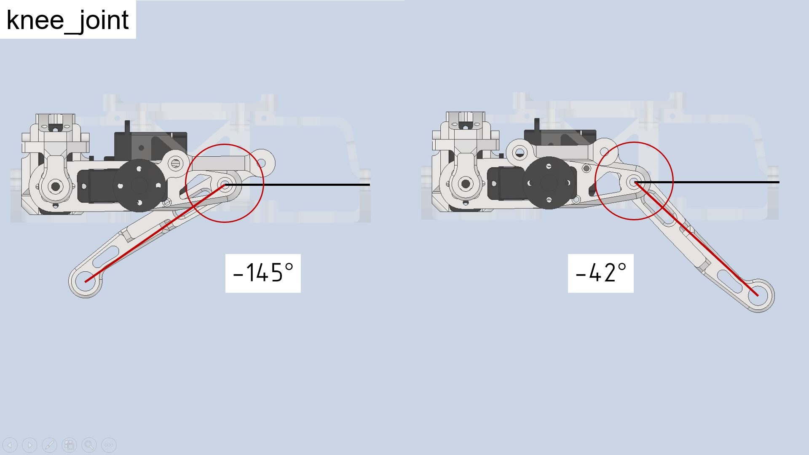
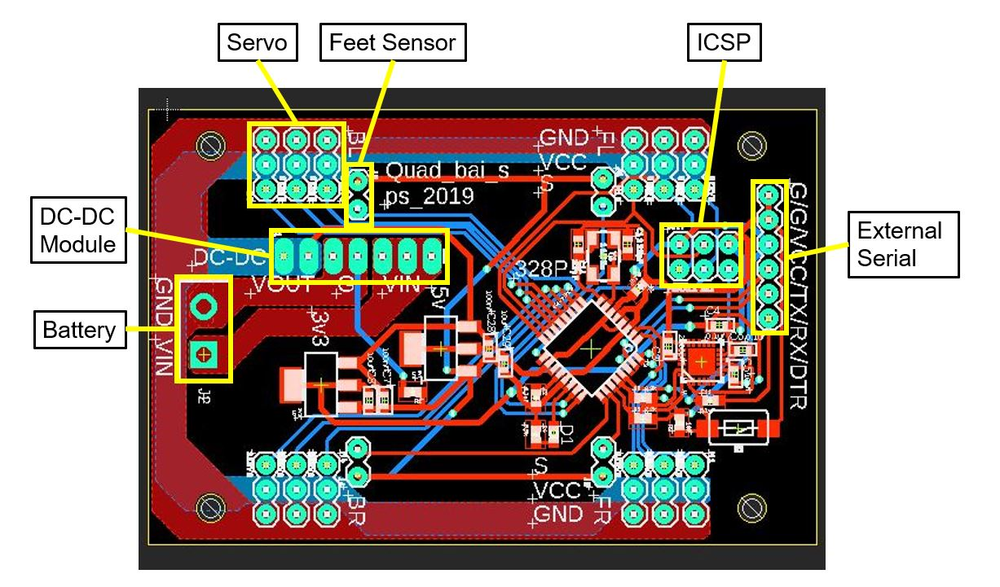
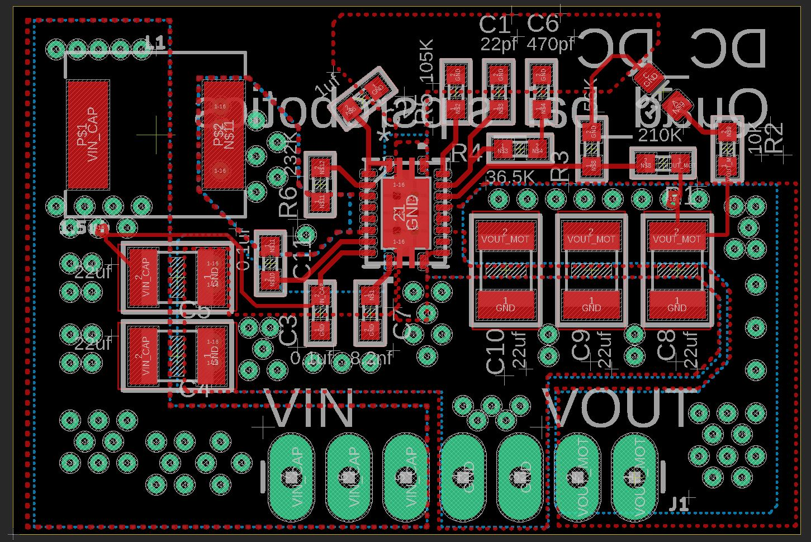
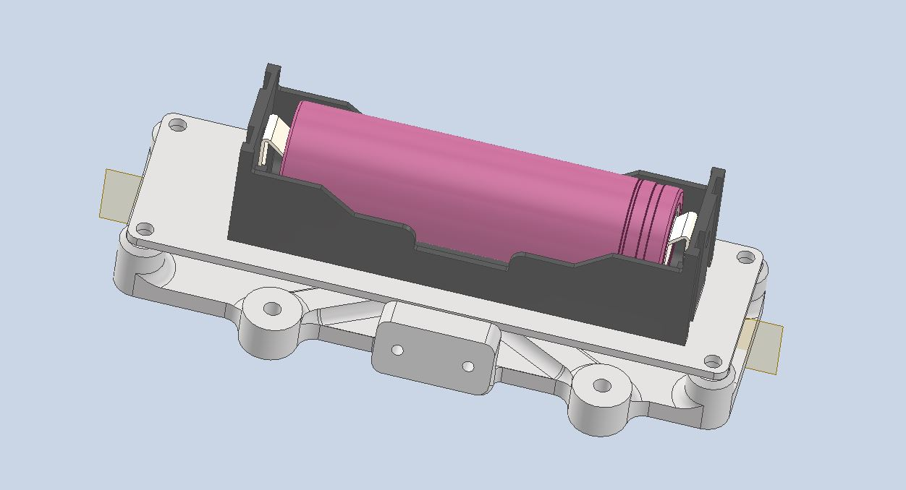
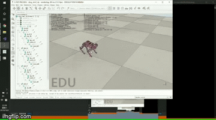

# Quadruped_bai_servo v1

A low cost 12DOF quadruped, actuated by hobby servos. Notice that this is an early version developed back in 2019. If you're looking for a high performance desktop quad, check out the ongoing [Quadruped bai tiny](https://github.com/psrobotics/Quadruped_bai_tiny)

This repository contains the models, BOM, electronic, simulate, as well as the source code of the project.

## Videos

[Balancing](https://www.youtube.com/watch?v=fsc0w1NeIVk)

[Walking](https://youtu.be/FCRvykWv6ok)

## Hardware

Required parts are listed below. For all printed parts, the recommended printing infill is 70%. Set up proper printing direction and support based on your printer type.

| Part Name                                                   | Quantity | Link                                                         | Info                |
| ----------------------------------------------------------- | -------- | ------------------------------------------------------------ | ------------------- |
| leg_tip                                                     | 2        | [STL file](hardware/stl)                                     | Printed part        |
| leg_tip_MIR                                                 | 2        | /                                                            | /                   |
| leg_2                                                       | 2        | /                                                            | /                   |
| leg_2_MIR                                                   | 2        | /                                                            | /                   |
| leg_link_1                                                  | 2        | /                                                            | /                   |
| leg_link_1_MIR                                              | 2        | /                                                            | /                   |
| leg_link-1                                                  | 2        | /                                                            | /                   |
| leg_link-1_MIR                                              | 2        | /                                                            | /                   |
| leg_1                                                       | 2        | /                                                            | /                   |
| leg_1_MIR                                                   | 2        | /                                                            | /                   |
| leg_1_2                                                     | 2        | /                                                            | /                   |
| leg_1_2_MIR                                                 | 2        | /                                                            | /                   |
| servo_holder_1                                              | 2        | /                                                            | /                   |
| servo_holder_1_MIR                                          | 2        | /                                                            | /                   |
| hip_joint_holder_1                                          | 2        | /                                                            | /                   |
| hip_joint_holder_1_MIR                                      | 2        | /                                                            | /                   |
| hip_holder_2                                                | 2        | /                                                            | /                   |
| hip_holder_2_MIR                                            | 2        | /                                                            | /                   |
| joint_ab_holder                                             | 2        | /                                                            | /                   |
| body_bridge                                                 | 2        | /                                                            | /                   |
| body_frame_2                                                | 1        | /                                                            | /                   |
| body_frame_1                                                | 1        | /                                                            | /                   |
| pcb_holder                                                  | 2        | /                                                            | /                   |
| M3*8                                                        | ~20      | /                                                            | Screw               |
| M3*12                                                       | ~30      | /                                                            | /                   |
| M3*16                                                       | ~20      | /                                                            | /                   |
| M2*8                                                        | ~50      | /                                                            | /                   |
| M2*15                                                       | ~50      | /                                                            | /                   |
| M2*20                                                       | ~20      | /                                                            | /                   |
| M2*26                                                       | ~20      | /                                                            | /                   |
| SF-1 0305 Self Lubricating Composite Bearing Bushing Sleeve | ~25      | [ebay](https://www.ebay.com/itm/141882850401?_trkparms=amclksrc%3DITM%26aid%3D1110006%26algo%3DHOMESPLICE.SIM%26ao%3D1%26asc%3D20200818143230%26meid%3Df2f23010710f47e39153549f7afe6b5b%26pid%3D101224%26rk%3D2%26rkt%3D5%26sd%3D141882852158%26itm%3D141882850401%26pmt%3D0%26noa%3D1%26pg%3D2047675%26algv%3DDefaultOrganicWeb%26brand%3DUnbranded&_trksid=p2047675.c101224.m-1) | For rotation joints |
| EMAX ES08A II Servo                                         | 12       | [EMAX](https://emaxmodel.com/products/emax-es08a-ii-mini-plastic-gear-analog-servo-1-8kg-sec-for-rc-models-robot) | Actuator            |

After printing your parts, insert the bearing at all 5mm holes locates around rotations joints. Then fasten  parts with M3 screws. Remember to check the rotation friction, make sure all joints can rotates freely with the servo installed. 

### Servo selection

The performance of actuators is of fundamental importance for legged robots. Even when we're building a small one. Ideal actuators for this design should be highly back-drivable, have high power density, and be torque-controllable. However, most off-the-shelf servos have nothing to do with these features. There are some high voltage brushless servos (with magnetic encoders for feedback) with relatively good performance, but they're extremely costive at this size. If you have enough budget, why not build a brushless one? Considering that you'll need 12 servos for the assembly, my suggestion is just to go for the budget choice. The EMAX ES08A (metal gear version) works fine for my build. The nylon gear version is also acceptable, but they can easily be damaged under impact.

### Body assembly

The robot consists 4 legs and a body frame. Assembly 2 legs first.

Assembly another 2 mirrored legs. Then link all legs to the body frame.

### Feet Sensor (optional)

Additional feet sensors can detect whether foot have touched the ground. This can be helpful when changing the state machine from 'swing state' to 'stance state'. The foot of Quadruped bai servo is switchable. If you decided to add feet sensors, some additional configurations are needed for the firmware (would be detailly explained later). 

Feet sensors are built around micro switches,  which detect impact from specific directions. As for the result, this design didn't work that well. A good feet sensor solution should be able to detect impacts from all directions, with low latency and clear output. [Open Dynamic Robot Initiative](https://open-dynamic-robot-initiative.github.io/) has presented an elegant solution with infrared sensor. Take that as a reference, the ongoing Quadruped bai tiny will come with better feet sensors. Assembly the feet sensor as this pic shown. (Remember to print mirrored parts for right-side legs)

Only 3 printed parts are needed to assembly the feet sensor, check [STL file](hardware/stl/feet_sensor) here.

In order to increase the friction between feet and ground, additional high-friction coating is vital. I used some glued silicone sheet on the feet tip. You can also design your feet tip and print it with high-friction material.

### Servo Calibration

Most servos have a limited motion range,  make sure the servo's motion range covers leg linkage's joint limit shown in the following pics.  Also, pre-calibrate in this step by applying an initial PWM signal to servos before installing (eg. 0°). This enables all servos to have the same PWM-joint angle mapping. You can then fine-tuning them in the firmware.

## Electronic

The controller board assembly includes servo controller, IMU, and dc-dc converter module. With an additional serial port, you can connect robot to a wireless or Bluetooth module that enables wireless control. Built around ATmega328P, the microcontroller's performance, IO is just not enough for such application. I encourage you take this schematic as a reference and switch to a high performance 32-bit microcontroller (something like STM32H7, ESP32). If you're more comfortable with AVR Arduino boards, use this design directly and it'll work.

[PCBs](electronic/) are designed with [EAGLE](https://www.autodesk.com/products/eagle/free-download). Exported Gerber file is uploaded too. If you don't want to order the PCB, you can also make it using off-the-shelf components (Arduino nano, MPU 6050, dc-dc converter, etc).

### Controller board pin assignment

Use ICSP to upload firmware and debug with the external serial port. The hardware IIC pins(A4,A5) are occupied by IMU (MPU6050 is also an 'old chip', you can replace with something like BNO080). 

### DC-DC converter

Integrated boost converter to power servos. Pre-configured output voltage is 5.5V, you can change by [replacing](https://www.ti.com/lit/ds/symlink/tps61088.pdf?ts=1644121246192#:~:text=The%20TPS61088%20is%20a%20high,size%20solution%20in%20portable%20systems.&text=The%20device%20has%2010%2DA,voltage%20up%20to%2012.6%20V.) the feedback resistor. Plug this module to the DC-DC slot on controller board.

### Battery

Single-cell lithium batteries with high current output capability(>10A) are preferred. This project uses 18650, 18350 batteries. The [battery shelf](hardware/step) can be printed and mounted under the robot frame.

## Simulate

Simplified model in [v-rep](https://www.coppeliarobotics.com/). You can use remote API to develop your simulation.

### Coordinate system in the simulation

TODO, write this docu when I'm free.

## Firmware

A simplified controller is implemented to generate trot pattern for walking. Here, I applied a state machine to easily synchronize a set of open foot trajectories (with feet sensor). The IMU unit is used to adjust body roll&pitch during the stance phase. Notice that this robot is only controlled on the kinematic level, don't expect it to resist external impacts during walking process.

## License

Under BSD-3-Clause license, COME WITH NO WARRANTIES, BUILD AT YOUR RISK.

